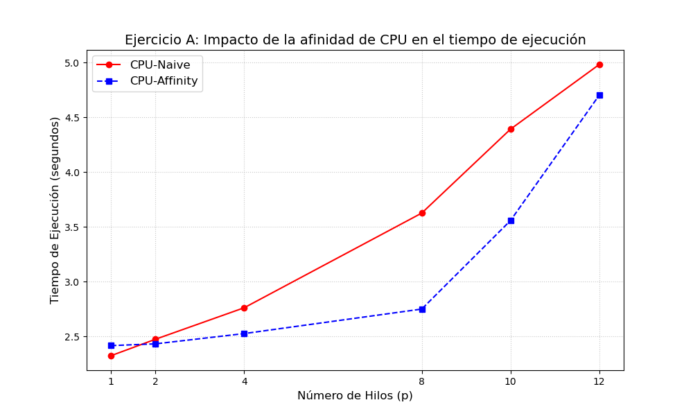
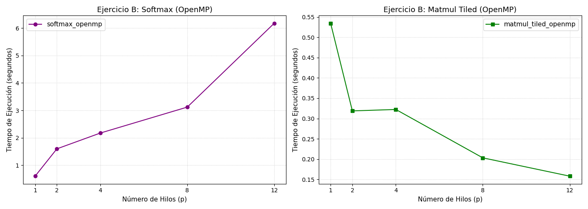

## Práctica de Clase 3: Programación de Sistemas Multiprocesador (Multihilos y Afinidad)

Este directorio contiene el laboratorio práctico 3[cite: 1], enfocado en comprender el impacto de la organización física de un computador —específicamente el uso de alineamiento de memoria, multihilos y afinidad de CPU— sobre el rendimiento de un programa[cite: 1].

### Entorno de pruebas

* **Sistema Operativo:** Ubuntu 24.04.2 LTS
* **Kernel:** 7.0.0-30-generic
* **Procesador:** 12th Gen Intel(R) Core(TM) i5-12450H
* **Arquitectura:** x86_64
* **Topología NUMA:** 1 Nodo
* **Núcleos:** 8 núcleos físicos / 12 hilos lógicos
* **Memoria RAM:** 15 GiB
* **Caché (L1d / L2 / L3):** 320 KiB / 7 MiB / 12 MiB

---

### Ejercicio A: Afinidad de CPU

| Hilos ($p$) | Tiempo `cpu-naive` ($T_p$) en segundos | Tiempo `cpu-affinity` ($T_p$) en segundos |
| :---: | :---: | :---: |
| **1** | 2.323 | 2.415 |
| **2** | 2.473 | 2.431 |
| **4** | 2.761 | 2.525 |
| **8** | 3.626 | 2.749 |
| **10** | 4.393 | 3.558 |
| **12** | 4.984 | 4.704 |

#### Análisis

Al analizar los tiempos de ejecución, se contrastan dos enfoques: `cpu-naive`, donde el sistema operativo tiene total libertad para planificar los hilos, y `cpu-affinity`, que controla el núcleo exacto donde se ejecuta cada hilo.

En la versión `cpu-naive`, el tiempo de ejecución aumenta drásticamente conforme se agregan más hilos, llegando a casi 5 segundos con 12 hilos. Esto se debe a la migración de hilos y los constantes cambios de contexto. Cuando el sistema operativo mueve un hilo de un núcleo a otro, debe guardar el estado actual y restaurarlo en el nuevo destino. Esto provoca que la memoria caché "se enfríe" (pérdida de localidad de los datos), forzando al procesador a buscar nuevamente la información en la memoria principal y aumentando la latencia.

Por otro lado, `cpu-affinity` aplica los principios de localidad vistos con la arquitectura NUMA. Al reservar memoria y anclar el hilo al mismo núcleo de trabajo, se garantiza que cada hilo inicialice con sus datos cerca. Incluso en topologías de un solo nodo, esto evita que los hilos reboten entre núcleos con distintas características arquitectónicas, asegurando que los datos se accedan por la ruta más rápida posible.

En conclusión, al mantener cada hilo anclado a un núcleo fijo, `cpu-affinity` preserva la localidad de la memoria caché y elimina la penalización de la migración de hilos. Esto explica por qué supera el rendimiento de `cpu-naive`, mitigando las principales fuentes de latencia en la programación paralela.

---

### Ejercicio B: OpenMP (`softmax_openmp` y `matmul_tiled_openmp`)

#### 1. `softmax_openmp`
| Hilos ($p$) | Tiempo `softmax_openmp` (s) |
| :---: | :---: |
| **1** | 0.600955 |
| **2** | 1.596940 |
| **4** | 2.173842 |
| **8** | 3.120286 |
| **12** | 6.178415 |

#### 2. `matmul_tiled_openmp`
| Hilos ($p$) | Tiempo `matmul_tiled_openmp` (s) |
| :---: | :---: |
| **1** | 0.534590 |
| **2** | 0.318765 |
| **4** | 0.322312 |
| **8** | 0.203212 |
| **12** | 0.158092 |

#### Análisis

Al analizar el comportamiento de ambas aplicaciones, se observa un contraste directo en la eficiencia del paralelismo. Por un lado, contrariamente a lo esperado, `softmax_openmp` no mejora al aumentar el número de hilos; de hecho, su rendimiento empeora drásticamente, pasando de 0.6 segundos con 1 hilo a más de 6 segundos con 12 hilos. Esto ocurre porque el problema maneja una tarea con una alta sobrecarga de sincronización en comparación con el trabajo útil de cómputo (grano fino). El tiempo que toma crear, gestionar y sincronizar los hilos supera por completo el beneficio de paralelizarlo, provocando que el *overhead* de OpenMP sature la ejecución.

En cambio, `matmul_tiled_openmp` muestra una escalabilidad positiva y real. El tiempo de ejecución disminuye progresivamente desde 0.53 segundos con 1 hilo hasta 0.15 segundos con 12 hilos. Al tratarse de una operación con alta intensidad aritmética (multiplicación de matrices por bloques optimizada para caché), el volumen de cómputo es lo suficientemente grande como para amortizar la creación de los hilos, permitiendo que el trabajo se distribuya de manera eficiente y reduzca el tiempo de forma notable.

---

### Uso de IA
* **Herramienta utilizada:** Google Gemini.
* **Propósito:** Apoyo en la estructuración de explicaciones teóricas y depuración del análisis de rendimiento.
* **Enlace de la sesión:** [https://share.gemini.google/2Onk4DfHYcal](https://share.gemini.google/2Onk4DfHYcal)